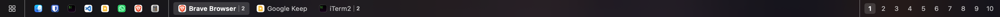

# GinBar

A lightweight, space-aware menu bar replacement for macOS. GinBar sits at the bottom of your screen and shows you the apps that are actually on the current Mission Control space — with quick space switching, window previews, and a searchable applications menu.



## Features

- **Per-space app list** — see only the apps and windows that belong to the current Mission Control space
- **Space switching** — click a space number to jump directly to that space
- **Window previews** — hover over an app to see thumbnails of its windows; hover over a space number to see a screenshot of that space
- **Pinned apps** — pin your favourite apps so they appear on every space
- **Applications menu** — a searchable menu with everything in `/Applications`, `~/Applications`, and `/System/Applications`
- **Smart fullscreen handling** — the bar hides automatically when a fullscreen app is active
- **Window spacing** — automatically resizes windows so they don't overlap the bar

## Requirements

- macOS 13 Ventura or later
- Xcode 15+ (if building from source)
- Screen Recording permission (for window previews and space screenshots)
- Accessibility permission (for window focusing and spacing)

## Installation

### Homebrew (recommended)

```bash
brew tap richmidwinter/ginbar https://github.com/richmidwinter/GinBar.git
brew install --HEAD ginbar
ln -sf $(brew --prefix ginbar)/GinBar.app /Applications/GinBar.app
```

Then launch **GinBar** from Launchpad, Spotlight, or Finder.

> **Note:** The formula is currently `HEAD`-only while the project is in active development. Once a stable release is tagged you will be able to install with `brew install ginbar`.

### Build from source

```bash
git clone https://github.com/richmidwinter/GinBar.git
cd GinBar
xcodebuild -project GinBar.xcodeproj -scheme GinBar -configuration Release
```

Then copy `build/Release/GinBar.app` to your `/Applications` folder.

## First launch

1. Open **GinBar** from `/Applications`
2. Grant **Accessibility** permission when prompted (System Settings → Privacy & Security → Accessibility)
3. Grant **Screen Recording** permission when prompted (System Settings → Privacy & Security → Screen Recording)
4. The bar will appear at the bottom of each Mission Control space

## Usage

- **Click an app** in the bar to focus it
- **Hover over an app** to see its window previews
- **Click a space number** to switch to that space
- **Hover over a space number** to see a preview of that space
- **Right-click an app** to pin/unpin it from the bar
- **Click the grid icon** on the far left to open the applications menu

## Uninstall

```bash
brew uninstall ginbar
rm /Applications/GinBar.app
```

## License

MIT
